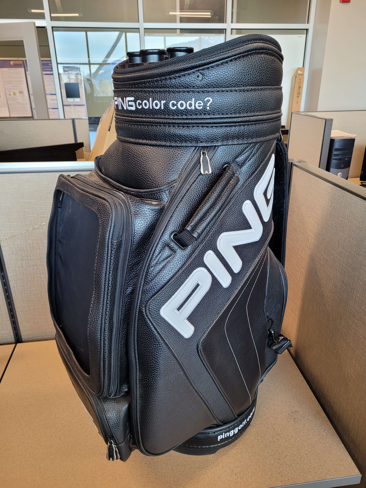
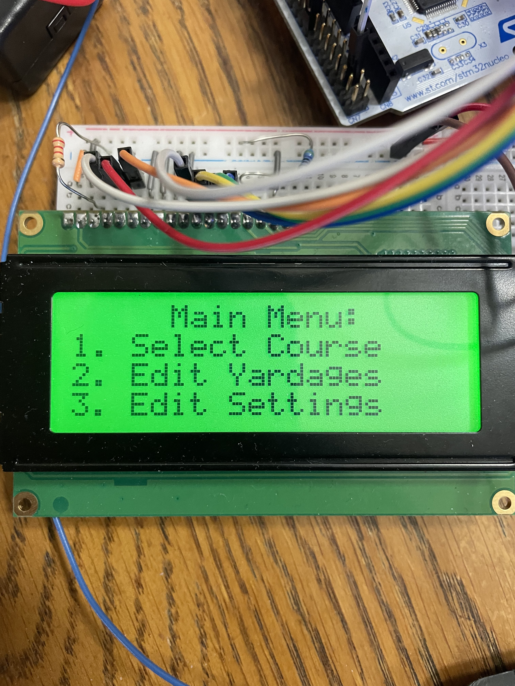
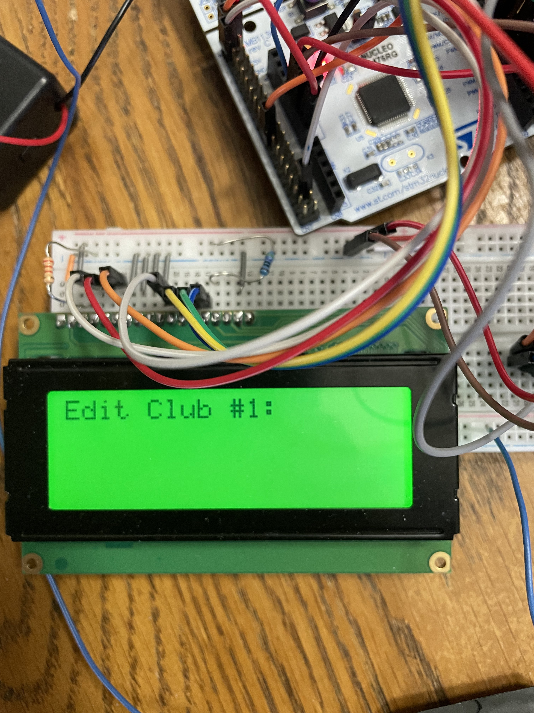
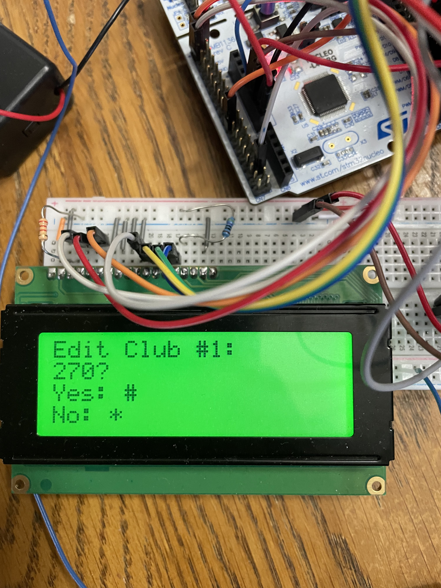
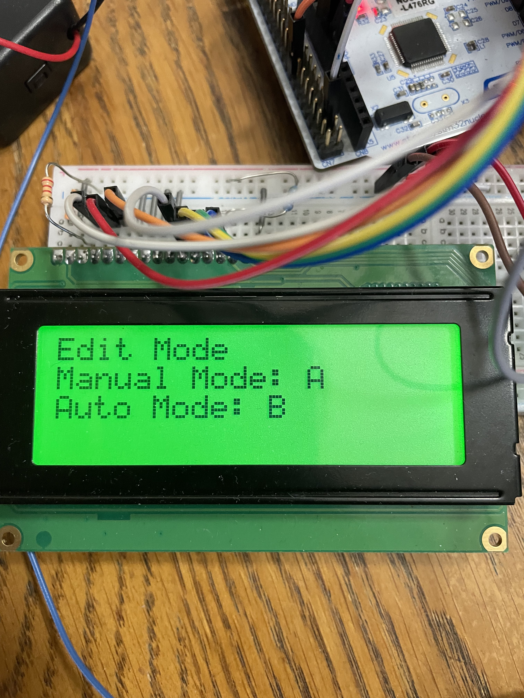
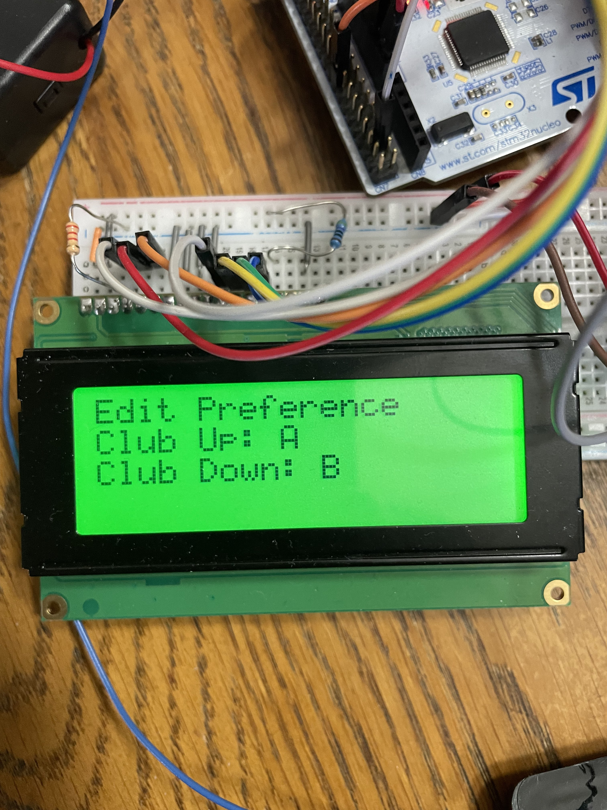
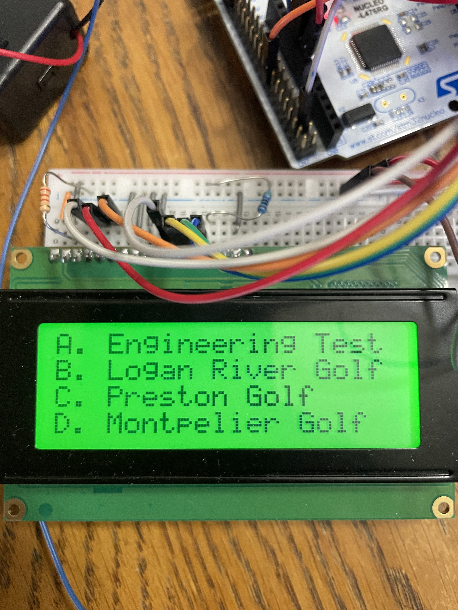
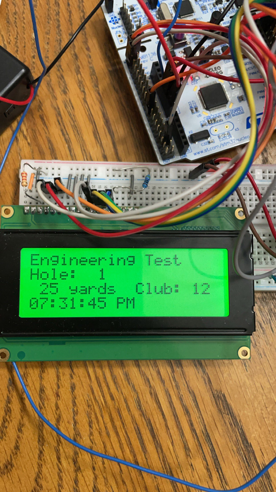

<!--Style rules:

# Window and button titles should be bold and capitalized.
# System tool, toolboxes (program functions) should be non-bold but italicized.
# Indent nested lists as needed to show levels of information.
# Information about the step needs to be on a separate line.
# Code that is entered needs to be on its own line, centered on the line, and in Courier font.
# Equations or algorithms need to be on their own line, centered on the line.-->
# Automatic Caddy User Manual
## Table of Contents
- Automatic Caddy User Manual
  - [Table of Contents](#table-of-contents)
  - [Introduction](#introduction)
  - [Description of Equipment](#description-of-equipment)
  - [List of materials/tools needed](#list-of-materialstools-needed)
  - [Safety warnings](#safety-warnings)
  - [Directions](#directions)
  - [Troubleshooting](#troubleshooting)
  - [Conclusion](#conclusion)
  
## Introduction
This manual is for the Automatic Caddy. It is designed to be easy to use and safe for the user. This manual will provide step-by-step instructions on how to use the Automatic Caddy, as well as information on the equipment and materials needed to operate it. The manual will also provide safety warnings and troubleshooting tips to ensure that the Automatic Caddy is used safely and effectively.

## Description of Equipment
The Automatic Caddy is a motorized caddy that is designed to carry golf clubs and other equipment. It is equipped with a motor and a battery, which allows it to select and present the optimal club to the user. The caddy is equipped with GPS so it can track your progress down the course. Using the location information from the GPS, the caddy selects the optimal club for the user. 

The user interacts with the caddy via the built in keypad and screen on the bag. They keypad allows the user to select from the options on the screen. They keypad allows the user to submit how far they hit the golf ball and the bag will average out the distance and select the optimal club for the user.

## List of materials/tools needed
The only additional materials/tools needed are your golf clubs and golf balls. 

## Safety warnings 

 Do not use the Automatic Caddy in wet conditions. The caddy is not waterproof and can be damaged if exposed to water.

 When storing the caddy, the battery should be disconnected,removed and stored in a cool, dry place.

 Do not to stop the caddy from spinning by hand. This can damage the motor and the caddy.

 Do not use the caddy if the battery is damaged or leaking.

 If the caddy is unable to rotate, turn the caddy off immediately. Continued use will damage the motor. 

## Directions

  The Automatic Caddy is easy to use. Follow these steps to get started:
1. To turn on the caddy, flip the power switch to the on position.
2. Once the caddy has fully initialized, the screen will display the options for the user.

  - If this is the first use, the user will need to input the distance they hit the golf ball with each club. Once the user has input the distances, the caddy will be able to give the optimal club for the user.
  
  

3. If wanted, Option 3 allows for custom preferences in club selection and operation mode.

4. Select a course from the list of courses on the screen.

  - The course will start on Hole 1. Press 'A' to go to the next hole. Press 'B' to return to the previous hole.

5. Once the course and hole is selected, the caddy will display the hole number and the distance to the hole.

6. After each hit, the user will input the distance they hit the ball. The caddy will average out the distances and select the optimal club for the user.  

## Troubleshooting
If you encounter any issues with the Automatic Caddy a simple power cycle will solve most problems. If a power cycle does not solve the issue, follow these troubleshooting tips to resolve the issue:

- The caddy is not turning on. What do I do?
  - Check the battery. If the battery is dead, charge it. 
  - If the battery is not the issue, check the power switch. If the power switch is off, turn it on.
  - If the battery and power switch are not the issue, the caddy may be damaged. Contact the manufacturer for assistance.
  
- The caddy is not selecting the optimal club. What do I do?
    - Check the distances you input for each club. If the distances are incorrect, input the correct distances again.
    
- The caddy is not displaying the correct hole number. What do I do?
  - Check the course and hole number you selected. If the course and hole number are incorrect, select the correct course and hole number. 
  
- The caddy is not displaying the distance to the hole. What do I do?
    - Check the course and hole number you selected. If the course and hole number are incorrect, select the correct course and hole number.
    
If the steps above do not solve the issue, the caddy may be damaged. Contact the manufacturer for assistance.

## Conclusion
The Automatic Caddy is a great tool for any golfer. It is easy to use and provides the optimal club for the user. The caddy is equipped with GPS so it can track your progress down the course. Using the location information from the GPS, the caddy selects the optimal club for the user. The caddy is easy to use and safe for the user. This manual provides step-by-step instructions on how to use the Automatic Caddy, as well as information on the equipment and materials needed to operate it. The manual also provides safety warnings and troubleshooting tips to ensure that the Automatic Caddy is used safely and effectively. 
